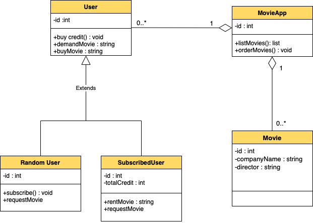

# Object-Oriented-Programming-Online-Film-Sistemi
Online film satan veya kiralayan uygulamanın sistemini tasarlayın. 

Uygulamada filmler listelenebilir, sıralanabilir ve kullanıcılar uygulamaya abone olabilir. 
Kullanıcılar abonelik için sistem üzerinden kredi satın alır. 
Sadece abone olan kullanıcılar, kredileri ile film kiralayabilir ve kiraladığı filmin kredi bedeli kadar hesabından düşülür. 
Normal kullanıcılar ve aboneler film satın alabilirler. 
Eğer film mevcut değil ise talep edilebilir. 
Bu sistemi tasvir eden Class(Sınıf) diyagramını çiziniz. 

